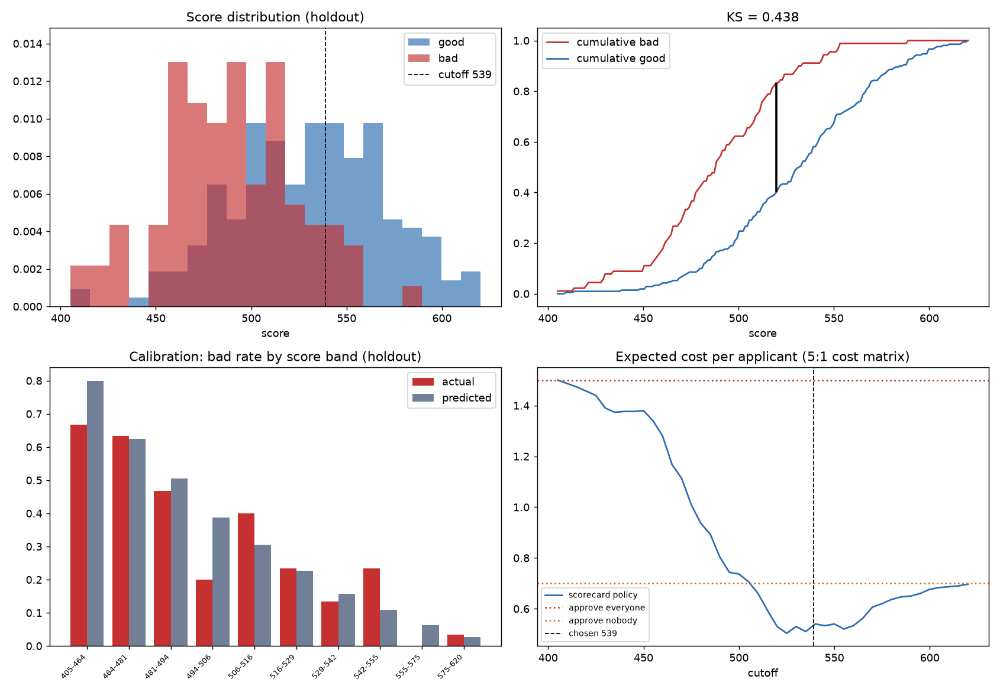

# Credit Scorecard — application scoring on German Credit

Quantum project #3. Builds a classic **application scorecard** the way a credit
risk team builds one — coarse classing, Weight of Evidence, Information Value,
logistic regression, points scaling — and then spends most of its effort trying
to prove the result isn't real.

There is an animated web explainer that walks through the whole build, ending in
a form where you score an applicant and watch the points add up.



## The method, in order

1. **Coarse classing.** Every characteristic becomes a handful of bins. Numeric
   ones are binned so the bad rate is **monotone** — a scorecard where risk rises,
   falls and rises again with loan size is one no credit officer will sign.
   Nominal ones are grouped by bad rate until each group carries at least 5% of
   the book.
2. **Weight of Evidence.** Each bin is replaced by
   `WOE = ln(%goods in bin / %bads in bin)`, so higher always means safer.
3. **Information Value.** Bins summed back up per characteristic; anything under
   0.02 is dropped as noise.
4. **Logistic regression on the WOE**, forward stepwise, with a **sign
   constraint**: every coefficient must be negative, because safer evidence has
   to push the score up. A characteristic whose meaning inverts in the
   multivariate fit is thrown out however significant it is.
5. **Stability selection.** The whole pipeline is rebuilt 25 times *inside the
   training set*; anything selected in fewer than half the resamples is dropped.
   On this run that removed `telephone`, which the single stepwise had admitted
   at p = 0.02 and which survived only 36% of resamples.
6. **Scaling to points.** PDO 20, 600 points at 50:1 odds, so 20 points always
   doubles the odds of repaying and the characteristics simply add up.

## Results (holdout, 300 applications never seen by any step above)

| Metric | Value |
|---|---|
| Gini | **0.560** (AUC 0.780) |
| KS | **0.438** |
| Train Gini | 0.659 — the gap is the overfit |
| PSI train vs holdout | 0.029 (stable) |
| Repeated CV Gini (25 rebuilds) | **0.560 ± 0.083**, 90% range 0.41–0.67 |

The interval is the headline, not the point estimate. On 700 training rows a
single holdout Gini moves by ±0.1 on the random seed alone, so quoting three
decimals without the spread would be theatre.

### Challengers

| Model | Holdout AUC | Interpretable |
|---|---|---|
| **Scorecard (WOE + logistic)** | **0.780** | full points table |
| Gradient boosting | 0.767 | no |
| Logistic on raw one-hot, no binning | 0.746 | coefficients only |

The interpretable model is not giving anything up here — coarse classing
regularises hard, and 700 rows is exactly where boosting has least room to win.
On a million-row book that ordering would very likely flip, and the honest
argument for the scorecard would be the points table, not the AUC.

### The cutoff

The dataset ships an asymmetric cost matrix: **funding a bad loan costs 5× what
turning away a good customer costs**. That, not accuracy, decides the approval
line.

| Policy | Cost per applicant |
|---|---|
| **Scorecard, cutoff picked on train (539)** | **0.530** |
| Approve everyone | 1.500 |
| Approve nobody | 0.700 |
| *Oracle tuning the cutoff on the holdout* | *0.483* |

That last row is the point of the exercise. Choosing the cost-minimising cutoff
on the same data you report the cost on flatters the result by ~10% and is the
easiest way to fool yourself in this whole pipeline — so the cutoff is chosen on
the training book and simply paid for on the holdout.

Under a 5:1 cost the optimal policy is brutal: approve 33% of applicants. A real
lender's matrix comes from loss-given-default and margin, not from a textbook,
and would land somewhere far less severe.

## Two characteristics are deliberately excluded

`personal_status_sex` (IV 0.043) and `foreign_worker` (IV 0.044) both carry
signal and are both protected characteristics. A lender may not price on sex or
nationality, so they never enter the model. They stay in the file for the
opposite reason: **not using an attribute is not the same as not acting on it**,
since other characteristics can proxy for it. The finished scorecard is audited
against them:

| Group | n | Actual bad rate | Approval rate | Mean score |
|---|---|---|---|---|
| female | 92 | 35.9% | 30.4% | 512.8 |
| male | 208 | 27.4% | 34.1% | 520.2 |

Adverse impact ratio **0.89**, above the four-fifths threshold. The group with
the lower approval rate also has the higher observed bad rate, so this is not by
itself evidence of a biased model — but it is exactly the analysis a lender has
to produce before deploying one. For `foreign_worker`, only one group clears the
minimum sample size, which is itself the finding: this book cannot say anything
about how the model treats the rare group.

## The data

`data/german.data` is not in the repository; it is downloaded from the UCI
archive on first run and cached locally. The download is checked against a
pinned SHA-256 before it is written, so a mirror serving a different revision
fails loudly instead of quietly changing every number above.

## Run it

**CLI** — full report to stdout, plus `scorecard.png` and
`scorecard_results.json`:

```bash
pip install -r requirements.txt
python3 scorecard.py
```

**Web explainer** — nine animated steps, an interactive underwriting form and a
draggable cutoff:

```bash
python3 server.py
```

Then open http://localhost:8000 (or set `PORT` if that one is taken).

The server builds the scorecard once (~10s), caches it, and hands the page a
single JSON payload; everything interactive is computed in the browser from
that payload, so no user input ever reaches the model code.

**Opening `index.html` straight off disk does not work** — a `file://` page is
not allowed to fetch the payload beside it. Serve the folder over HTTP instead;
any static server will do, because the page falls back to the committed
`scorecard_results.json` when no live model is listening:

```bash
python3 -m http.server 8000
```

That fallback is also what lets the explainer be published as a plain static
site with no backend at all.

## The charts

The chart colours are not taste. Every series colour was run through a
colour-vision validator against this page's own surfaces and clears each gate
in both light and dark:

| Check | Light (`#ffffff`) | Dark (`#141b26`) |
|---|---|---|
| Worst pair, protanopia ΔE (target ≥ 8) | **22.8** | **20.0** |
| Worst pair, normal vision ΔE (floor 15) | **29.6** | **27.1** |
| Lightness band · chroma floor · 3:1 contrast | pass | pass |

Dark mode is a *selected* theme, not an inverted one — the dark steps
(`#4e93e4` / `#e2685c`) were validated against the dark surface rather than
flipped from the light ones.

Two consequences worth naming, because they are the sort of thing that gets
eyeballed and got measured instead:

- The Weight-of-Evidence bars are a **diverging** scale, and they used to be
  green-versus-red — the single worst pairing for a red-green colour-blind
  reader, which is roughly one man in twelve. They are now blue↔red with a
  neutral grey at zero.
- The **status** colours (approve / decline) are a separate fixed scale that
  never does series work, and they always ship as icon + word + colour, so the
  decision never rests on hue alone.

Every chart carries a legend, a keyboard-reachable tooltip, and a **table
view** holding the same numbers — a value is never gated behind a hover.

## Data

[Statlog German Credit](https://archive.ics.uci.edu/dataset/144/statlog+german+credit+data)
(UCI), 1,000 applications contributed by Prof. Hans Hofmann, Universität Hamburg.
20 characteristics, 30% bad rate, amounts in Deutsche Mark — the file predates
the euro. Downloaded and cached on first run; no API key.

## Honest limitations

- **1,000 rows is not a book.** Every number here carries an interval you could
  drive a truck through, which is why the CV spread is reported next to the
  point estimate throughout.
- **No reject inference.** The file only contains applications that were
  accepted and observed, so the model is fitted on a population that has already
  been through someone else's credit policy. Every real scorecard has this
  problem and every real scorecard has to correct for it.
- **No out-of-time validation.** The applications carry no dates, so PSI here
  compares two random samples, not two time periods — which is the easy version
  of the test. Scorecards die of population drift, and this data cannot show it.
- **`checking_status` has an IV of 0.67**, which in a real project would trigger
  a leakage investigation before anything else. Here it appears to be genuine:
  it is the only characteristic that directly observes the applicant's
  relationship with the bank.

MIT licensed. Not credit advice, and nothing here is deployable.
